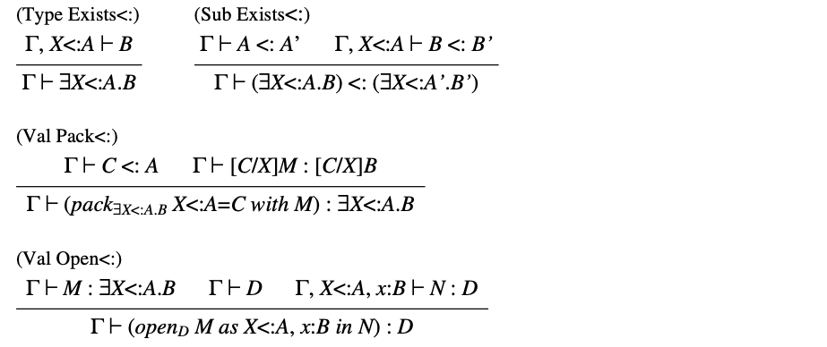

本文整理自 [Luca Cardelli, Type Systems](http://lucacardelli.name/papers/typesystems.pdf) 的第六章内容。欢迎 [star](https://github.com/wfnuser/plt) 和 [follow](https://github.com/wfnuser)。

# 子类型(Subtyping)
具有类型的面向对象编程语言有着非常有趣且复杂的类型系统。不同的面向对象语言中有着不同的特征，但其中有一个特征几乎普遍存在，即**子类型**(Subtyping)。子类型直观地刻画了类型之间的包含关系，所谓类型可以被视为值的集合。某个类型的元素也可以被视为其任何超类的元素，引入子类型后，编程语言就允许值(对象)在许多类型不同的上下文中灵活使用。

在考虑子类型关系时，通常会添加一个新的断言 $\Gamma \vdash A <: B$，表示 $A$ 是 $B$ 的子类型(表27)。其语义为 $A$ 中的任何元素都是 $B$ 的元素，或者更确切地说，$A$ 类型的程序也是 $B$ 类型的程序。

具有子类型的最简单的类型系统之一是一种对 $F1$ 的扩展，标记为为 $F1_{<:}$。 其在 $F1$ 的基础上添加了一种称为 $Top$ 的类型，它是所有类型的超类型。$F1$ 现有的类型规则也保持不变。子类型断言是独立公理化的，并添加了一个称为升级(subsumption)的类型规则，用于将类型断言与子类型断言相连接。

### 表27. 子类型断言

升级规则表明，如果一个项具有类型 $A$，而 $A$ 是 $B$ 的子类型，那么该项也具有类型 $B$。子类型的性质非常类似于集合的包含关系。

表28中的子类型关系被定义为反射性(reflexive)和传递性(transitive)关系，并具有一个称为 $Top$ 的最大类型。这个类型是所有良类型的项的类型。

函数类型的子类型关系规定，如果 $A’$ 是 $A$ 的子类型，且 $B$ 是 $B’$ 的子类型，则 $A→B$ 是 $A’→ B’$ 的子类型。请注意，函数参数的包含是逆变(contravariant)的，而函数结果的包含是协变的(covariant)。简单的推理就可以论证这一点。类型为 $A→B$ 的函数 $M$ 接受类型 $A$ 的元素；显然它也接受任何 $A$ 的子类型 $A’$ 的元素。同样的函数 $M$ 返回类型为 $B$ 的元素；显然它返回属于 $B$ 的任何超类型 $B’$ 的元素。因此，类型为 $A→B$ 的任何函数 $M$，也可以接受类型为 $A’$ 的参数并返回类型为 $B’$ 的结果，因此也具有类型 $A’→B’$。 我们因此可以说 $A→B$ 是 $A’→B’$ 的子类型。

### 表28. F1 的附加规则

可以在基本类型上添加特定的子类型规则，比如 $Nat <: Int$ [19]。

我们考虑的所有作为 $F_1$ 的扩展结构类型都可以采用简单的子类型规则；因此，这些结构类型也可以添加到 $F_{1<:}$ 中(表29)。通常，我们需要为每个类型构造器添加一个子类型规则，确保子类型规则与升级规则可以一起工作。对于积类型和联合类型，子类型规则会作用于每个分量上(component-wise)。对于记录和变体，子类型规则和长度有关(length-wise)：更长的记录类型是更短的记录类型的子类型(子类型规则作用时可能会丢失附加的字段)，而更短的变体类型则是更长变体类型的子类型(通过子类型规则可以引入更多的情况)。例如，

则有，

引用类型没有任何子类型规则：只有当 $A=B$ 时，$Ref(A) <: Ref(B)$ 才成立。这个严格的规则是必要的，因为引用既可以读取也可以写入，因此在行为上既是协变的也是逆变的。出于相同的原因，数组类型也没有子类型规则。

### 表29. F1 扩展的附加规则

相比于 $F_1$ 类型系统，在考虑递归类型时，$F_{1<:}$ 需要对环境的结构进行更改。这一次，我们必须向环境中添加**约束变量**(bounded variable)(表30)。由 $Top$ 绑定的变量对应于我们旧的无约束变量。对于递归类型(表31)的子类型规则(Sub Rec)的合理性的严谨论证并不简单，但却是符合直觉的。要检查 $μX.A <: μY.B$ 是否成立，我们可以假设 $X<:Y$，然后检查 $A <: B$；当在协变上下文中找到 $X$ 和 $Y$ 在 $A$ 和 $B$ 中的匹配出现时，可以利用这个假设进行证明。

### 表30. 约束变量的环境

### 表31. 递归类型的子类型

环境中的约束变量(bounded variable) 也是 $F_{2<:}$ 子类型扩展的基础，这将产生一个称为 $F_{2<:}$ 的系统(表32)。在这个系统中，项 $λX<:A.M$ 表示一个程序 $M$，其参数为类型变量 $X$，该变量代表 $A$ 的任意子类型。这是 $F_2$ 的泛化，因为 $F_2$ 项 $λX.M$ 可以表示为 $λX<:Top.M$。与项 $λX<:A.M$ 对应的是形如 $\forall X<:A.B$ 的约束类型量词(bounded type quantifiers)。

### 表32. F2 的语法

$F2<:$ 类型和项的作用域与 $F2$ 类型和项的作用域定义类似，只是 $\forall X<:A.B$ 在 $B$ 中绑定 $X$，但不在 $A$ 中绑定 $X$。

$F2<:$ 的类型规则包括大部分 $F1<:$ 的类型规则,即$(Env \ \phi)$，$(Env \ x)$，$(Type \ Top)$，$(Type \ Arrow)$，$(Sub \ Refl)$，$(Sub \ Trans)$，$(Sub \ Top)$，$(Sub \ Arrow)$，$(Val \ Subsumption)$，$(Val \ x)$，$(Val \ Fun)$和$(Val \ Appl)$，以及变量的规则，即$(Env \ X<:)$，$(Type \ X<:)$和$(Sub \ X<:)$，以及表33中列出的多态的规则。

### 表33. 约束全称量词(bounded universal quantifiers)的规则

相比于 $F_2$，我们不需要向 $F_{2<:}$ 添加其他类型构造，因为所有常见类型都可以被已有的构造表示(除了递归)。此外，事实证明，$F_2$ 中使用的编码也满足了子类型规则的需要。例如，可以对存在类型进行编码，以满足表34中描述的规则。类型 $\exists X<:A.B$ 表示**部分抽象类型**(partially abstract type)，其表示类型 $X$ 不完全已知，但一定是 $A$ 的子类型。这种部分抽象在一些基于子类型的语言中有用到(例如，在 Modula-3 中)。

### 表34. 约束存在量词(bounded existential quantifiers)的规则

为了在 $F_{2<:}$ 中满足预期的子类型规则，需要对 $F_{2<:}$ 中的记类型录和变体类型进行编码，这需要一些复杂的工作，可以参考[6]。

## 参考
[6] Cardelli, L., Extensible records in a pure calculus of subtyping. In Theoretical Aspects of Object-Oriented Programming, C.A. Gunter and J.C. Mitchell, ed. MIT Press. 373-425. 1994.
[19] Mitchell, J.C., Coercion and type inference. Proc. 11th Annual ACM Symposium on Principles of Programming Languages, 175-185. 1984.

##
