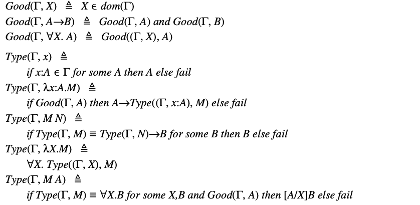

本文整理自 [Luca Cardelli, Type Systems](http://lucacardelli.name/papers/typesystems.pdf) 的第八章内容。欢迎 [star](https://github.com/wfnuser/plt) 和 [follow](https://github.com/wfnuser)。

# 类型推断

类型推断是在给定类型系统内推理项类型的问题，如果存在类型的话。由于在我们之前考虑过的类型系统中，程序通常有丰富的类型注释，因此类型推断问题通常只是在检查这些注释的一致性。但这个问题并不总是这样简单的。但在 $F_1$ 的类型系统中，我们仍然可以找到简单的类型检查算法。

有一类更难的问题被称为**可类型化**(typability)或**类型重构**(type reconstruction), 即为一个未经类型注释的程序 $M$，找到一个环境 $\Gamma$，一个带有类型注释的版本 $M'$，以及一个类型 $A$，使得 $A$ 是环境 $\Gamma$ 中的 $M'$ 的类型。（一个带有类型注释的程序 $M'$ 去除所有类型注释后即还原为 $M$。）对于无类型的 λ-演算，可以通过在 ML 中使用的 Hindley-Milner 算法在 $F_1$ 中解决类型重构问题；此外，该算法能够为一个给定的 $F_1$ 中的 λ-项 生成唯一的类型表示。然而，在 $F_2$ 中，对于无类型的 λ-演算，类型重构问题则无法解决[32]。在具有子类型的系统中进行类型重构也仍然是一个较开放的问题，尽管一些特殊解决方案开始出现[1,10,13,24]。

在这里，我们会着重介绍一些代表性系统中的类型推断算法，包括：$F_1$、$F_2$ 和 $F_{2<:}$。前两个系统具有唯一类型属性(unique type property)：如果一个项有类型，那么它只有一个类型。在 $F_{2<:}$ 中，则不存在唯一类型，因为子类型规则的存在，每个项都拥有某个类型及其所有超类型。但是，存在最小类型属性(minimum type property)：如果一个项有一组类型，那么这一组类型在子类型顺序上有一个最小元素[8]。这个最小类型属性适用于 $F_{2<:}$ 和 $F_{1<:}$ 的许多常见扩展。但在引入了基本类型的自定义子类型时可能会失效。

### 类型推断问题

类型推断问题是指，在给定的类型系统中，考虑一个环境 $\Gamma$ 和一个项 $M$，是否存在一个类型 $A$，使得 $\Gamma \vdash M : A$ 是有效的？以下是一些示例：

- 在 $F_1$ 中，给定 $M \equiv λx:K.x$ 和任何形式良好的 $\Gamma$ ，我们有 $\Gamma \vdash M : K→K$ 。

- 在 $F_1$ 中，给定 $M \equiv λx:K.y(x)$ 和 $\Gamma \equiv \Gamma ’, y:K→K$，我们有$\Gamma \vdash M : K→K$。

- 在 $F_1$ 中，对于任何类型 $B，λx:B.x(x)$ 都没有类型。

- 但是，在 $F_{1<:}$ 中，对于任何类型 $B$，存在类型 $\Gamma \vdash λx:Top→B.x(x) : (Top→B)→B$，因为 $x$ 也可以被赋予类型 $Top$。

- 此外，在带有递归类型的 $F_1$ 中，对于 $B \equiv μX.X→X$ ，存在类型 $\Gamma \vdash λx:B.(unfoldB \ x)(x) : B→B$ ，因为 $unfoldB \ x$ 的类型是 $B→B$。

- 最后，在 $F_2$ 中，对于 $B \equiv \forall X.X→X$ ，存在类型 $\Gamma \vdash λx:B. x(B)(x) : B→B$ ，因为 $x(B)$ 的类型是 $B→B$。

我们从 $F_1$ 的类型推断算法开始介绍，如表35所示。该算法可以通过简单的方式扩展到我们之前研究的所有一阶类型结构。这是 Pascal 和所有类似的过程性语言中使用的类型检查算法的基础。

最主要的 $Type(\Gamma, M)$ 过程接受一个环境 $\Gamma$ 和一个项 $M$，并生成 $M$ 的唯一类型（如果有的话）。指令 $fail$ 会导致算法全局失败：它表示产生了一个类型错误。在本节介绍的所有算法中，我们都假设初始的环境参数 $\Gamma$ 是良构的。（例如，当检查整个程序时，我们可以从空环境开始。） 无论如何，我们都可以轻松编写一个子程序来检查环境是否良构。对于$λx:A.M$ 情况，应该增加一个限制，要求 $x \notin dom(\Gamma)$，因为 $x$ 用于扩展$\Gamma$。 当然，这种限制可以通过重命名轻松规避。因此，我们在表35、36和37中省略了这种类型的限制。

## 表35. $F_1$ 的类型推断

作为示例，让我们尝试在环境 $/phi, \ y:K→K$ 中对 $λz:K.y(z)$ 项进行类型推断。我们在这里提供了一个完整的 $F_1$ 推导。算法的步骤如下：

$F_2 的类型推断算法（见表36）并不比 $F_1$ 的算法更困难，但它需要引入一个额外的子过程 $Good(\Gamma, A)$ 来验证源程序中遇到的类型是否合法。这个检查是必要的，因为在 $F_2$ 类型系统中存在未绑定的类型变量。此外，在类型实例化的情况下，还需要引入一个替换子过程，即 $M A$。

## 表36. $F_2$ 的类型推断算法

$F_{2<:}$ 的类型推断算法如表 37 所示，更为复杂。$Subtype(\Gamma, A, B)$ 试图判断在环境 $\Gamma$ 中， $A$ 是否是 $B$ 的子类型，乍看起来似乎很直接。然而，人们已经证明 $Subtype$ 只是一个半算法(semialgorithm)：它可能在某些不存在子类型关系的类型对 $A$、$B$ 上发散(diverge)。换句话说，对于类型不一致的程序，$F_{2<:}$ 的类型检查器可能会发散，尽管对于类型良好的程序仍会收敛并产生最小类型。更一般地说，$F_{2<:}$ 的类型系统是不可判定的[25]。已经过许多不同的工作试图将 $F_{2<:}$ 缩减为可判定的子集；目前最简单的解决方案是要求 $(Sub \ Forall<:)$ 中的量词界限相等(equal quantifiers bound)。无论如何，不一致的 $A$、$B$ 对在实践中出现概率很小。因此，这个算法在通常意义上仍然是安全的(sound)：只要它能找到一个类型，程序就不会出错。唯一令人担忧的情况只会出现在量词的子类型判定中，而将算法限制在 $F_{1<:}$ 中则是可判定的，并且可以得到正确的最小类型。

## 表37. $F_{2<:}$ 的类型推断算法

$F_{2<:}$ 就提供了一个有趣的例子，说明在类型推断中可能会有异常情况的(编者: 指的应该是会陷入无限循环的情况)。上面给出的类型推断算法在理论上是不可判定的(undecidable)，但在应用中却是可行的。它在几乎所有的程序上都是收敛且高效的；只有在一些类型病态(ill typed)的程序上才会发散，而这些程序本来就应该被拒绝。因此，根据引言中提出的标准，$F_{2<:>}$ 处于可接受和不可接受的类型系统的界限上。

# 参考
[1] Aiken, A. and E.L. Wimmers, Type inclusion constraints and type inference, Proc. ACM Conference on Functional Programming and Computer Architecture, 31-41. 1993.  
[8] Curien, P.-L. and G. Ghelli, Coherence of subsumption, minimum typing and type-checking in F≤. Mathematical Structures in Computer Science 2(1), 55-91. 1992.  
[10] Eifrig, J., S. Smith, and V. Trifonov, Sound polymorphic type inference for objects. Proc. OOPSLA’95, 169-184. 1995.  
[13] Gunter, C.A. and J.C. Mitchell, ed., Theoretical Aspects of Object-Oriented Programming. MIT Press. 1994.  
[24] Palsberg, J., Efficient inference for object types. Information and Computation. 123(2), 198- 209. 1995.  
[25] Pierce, B.C., Bounded quantification is undecidable. Proc. 19th Annual ACM Symposium on Principles of Programming Languages. 305-315. 1992.  
[32] Wells, J.B., Typability and type checking in the second-order λ-calculus are equivalent and undecidable. Proc. 9th Annual IEEE Symposium on Logic in Computer Science, 176-185. 1994.  

##
